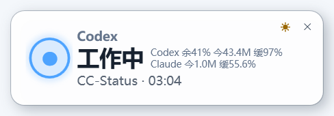

# CC Status

Windows 桌面悬浮小组件，用颜色和提示音显示 Codex 与 Claude Code CLI 的当前状态。



- 蓝色：工作中
- 橙色：需要批准
- 绿色：已完成
- 灰色：等待任务

CC Status 通过 Codex 与 Claude Code 的本地生命周期事件显示状态。它只保存任务来源、会话 ID、状态、时间和工作目录，不读取或保存提示词、命令内容或聊天文本。

## 安装

推荐直接运行 `CC-Status-Setup-1.0.0.exe`。安装后，桌面会创建“CC Status”快捷方式，开始菜单提供打开、退出和卸载入口。

也可以使用 ZIP 版：

1. 双击 `Install.cmd`。
2. 安装程序会把 CC Status 的状态 Hook 合并到 Codex 和已安装的 Claude Code 用户配置中，并保留已有配置。
3. 重启 Codex 或 Claude Code 可确保配置生效。

默认安装目录是 `%LOCALAPPDATA%\CC Status`。安装不需要管理员权限，也不会修改系统 PowerShell 执行策略。

如果 Claude Code CLI 未安装，安装程序会跳过 Claude 配置并给出提示；如果现有 `settings.json` 不是有效 JSON，则不会覆盖该文件，CC Status 和 Codex 集成仍会完成安装。

## 使用

- 拖动卡片可调整位置。
- 右键托盘图标，在“主题”菜单中切换黑色或白色主题；选择会自动保存。
- 双击卡片或点击操作按钮会按任务来源切换窗口：桌面任务打开 Codex，CLI 任务打开对应终端。
- 双击托盘里的图标可重新显示隐藏的小组件；关闭小组件窗口只会隐藏到托盘。
- 只有托盘菜单的“退出”才会结束进程。
- “已完成”显示 90 秒，随后恢复为灰色等待状态。
- 多任务状态优先级为：需要批准 > 工作中 > 已完成。

### 用量信息

组件右侧分别显示 Codex 和 Claude 的用量：`余` 表示 7 天限额剩余比例，`今` 表示本地当天 Token 用量，`缓` 表示缓存命中比例；无法取得的数据统一显示 `-`。Codex 当前可显示三项数据，Claude 暂无可用的 7 天限额数据，因此其 `余` 显示 `-`。

- Codex：读取 `%USERPROFILE%\.codex\sessions` 下的本地 rollout 记录。当天 Token 使用增量和缓存 Token 来自 `token_count` 事件；7 天剩余额度来自同一事件中 10080 分钟窗口的限额数据。
- 官方 Claude：读取 `%USERPROFILE%\.claude\projects` 下的本地 transcript，按消息 ID 去重后统计当天输入、输出、缓存读取和缓存创建 Token。
- CC Switch 管理的 Claude 自定义接入：只读查询 `%USERPROFILE%\.cc-switch\cc-switch.db` 中当天成功请求的用量记录，汇总 proxy 与 session log 数据；查询结果缓存 60 秒，避免频繁访问数据库。数据库不可用时回退到本地 transcript 估算。

Token 和缓存数据均来自本机记录，不调用 Codex 或 Claude 的账户计费接口。由于日志缺失、跨设备使用或第三方转发记录方式不同，显示值可能与服务商账户后台存在差异。

## Hooks

安装程序会合并 CC Status 所需的 Codex 与 Claude Code Hooks，不覆盖其他字段或已有 Hook。组件启动时会检查配置；如果配置被其他工具覆写，会自动补回缺失项。Claude Code 在会话启动时读取 Hook，自动修复后需要新开会话才能生效。

## 卸载

使用开始菜单里的“卸载 CC Status”，或双击安装包中的 `Uninstall.cmd`。卸载程序会停止正在运行的组件，只删除本组件添加的 Hook、启动入口和安装目录，并在修改 Codex/Claude 配置前创建备份。安装和卸载均不会清理已有的 `hooks.json` / `settings.json` 备份。

## 开发验证

在 PowerShell 中运行：

```powershell
powershell.exe -NoProfile -ExecutionPolicy Bypass -File .\tests\Test-StatusBridge.ps1
powershell.exe -NoProfile -ExecutionPolicy Bypass -File .\tests\Test-RolloutMonitor.ps1
powershell.exe -NoProfile -ExecutionPolicy Bypass -File .\tests\Test-ApprovalMonitor.ps1
powershell.exe -NoProfile -ExecutionPolicy Bypass -File .\tests\Test-AgentUsage.ps1
powershell.exe -NoProfile -ExecutionPolicy Bypass -File .\tests\Test-Installer.ps1
```

安装包构建：

```powershell
powershell.exe -NoProfile -ExecutionPolicy Bypass -File .\installer\Build-Installer.ps1
```

构建脚本会清理 `D:\VibeCoding` 下旧版本的 CC Status 安装包、编译控制程序、生成 `D:\VibeCoding\CC-Status-Setup-1.0.0.exe`，并可静默安装验证文件、版本、Hooks、桌面快捷方式和进程。可用 `-SkipValidation` 跳过安装验证。安装包不再写入仓库目录。

状态主要来自 Codex 与 Claude Code 的任务提交、权限请求、工具执行、停止及会话结束事件。Claude 手动拒绝权限时，组件还会检查对应 transcript 的工具结果，避免状态卡在“需要批准”。
