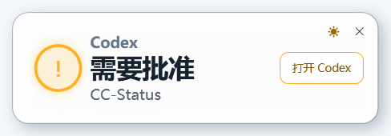

# CC Status

Windows 桌面悬浮小组件，用颜色和提示音显示 Codex 与 Claude Code CLI 的当前状态。

[下载最新版](https://github.com/ningrain/CC-Status/releases/latest) · [更新日志](CHANGELOG.md)

| 工作中 | 需要批准 |
|:---:|:---:|
|  |  |
| 已完成 | 无任务 |
|  |  |

- 蓝色：工作中
- 橙色：需要批准
- 绿色：已完成
- 灰色：无任务

CC Status 通过 Codex 与 Claude Code 的本地生命周期事件显示状态。本地状态文件会记录提供方、模型、会话/任务 ID、状态、时间、工作目录和任务界面来源。为统计用量和识别 Claude 中断或权限结果，组件还会读取本地 rollout、transcript 及可用的 CC Switch 数据库，但不会展示、上传或持久保存提示词、命令内容和聊天正文。

## 安装

支持 Windows x64，需要系统自带的 Windows PowerShell 和已安装的 Codex 或 Claude Code。

推荐从 [Releases](https://github.com/ningrain/CC-Status/releases/latest) 下载 `CC-Status-Setup-<版本>.exe` 安装；同页提供 `.sha256` 校验文件。安装后，桌面会创建“CC Status”快捷方式，开始菜单提供打开、退出和卸载入口，并配置开机自启。

默认安装目录是 `%LOCALAPPDATA%\CC Status`。再次运行安装程序时，会优先使用已登记的安装目录；同版本支持修复安装，新版本支持升级，不允许降级。如果检测到安装版正在运行，点击“确定”会请求其退出后继续安装，无需先手动卸载。

也可以克隆仓库或通过 GitHub 的 **Code → Download ZIP** 获取源码后安装：

1. 双击 `Install.cmd`。
2. 安装程序会把 CC Status 的状态 Hook 合并到 Codex 和已安装的 Claude Code 用户配置中，并保留已有配置。
3. 重启 Codex 或 Claude Code 可确保配置生效。

安装不需要管理员权限，也不会修改系统 PowerShell 执行策略。源码安装与下方的“源码运行”不同：前者会复制文件并创建启动入口，后者直接运行仓库中的程序。

如果 Claude Code CLI 未安装，安装程序会跳过 Claude 配置并给出提示；如果现有 `settings.json` 不是有效 JSON，则不会覆盖该文件，CC Status 和 Codex 集成仍会完成安装。

### 源码运行

不安装也可以直接运行。在仓库根目录执行：

```powershell
powershell.exe -NoProfile -ExecutionPolicy Bypass -STA -File .\app\CCStatus.ps1
```

该方式使用仓库内的 `app/data` 保存设置和运行数据，不会创建安装版的快捷方式或开机自启入口。程序启动时仍会配置状态 Hooks，因此并非完全不修改用户配置。安装版与源码版共用单实例限制；切换前请先从托盘退出当前实例，再启动目标版本。

## 使用

- 拖动卡片可调整位置。
- 点击组件右上角的太阳/月亮按钮可切换黑色或白色主题；右键托盘图标可显示或隐藏组件、切换保持置顶以及退出。主题、位置和置顶设置会自动保存。
- 点击右上角的铃铛按钮可开启或关闭提示音，悬停可查看当前开关状态。开关会自动保存；提示音用于需要批准和已完成状态。
- 双击卡片或点击操作按钮会按任务来源切换窗口：桌面任务打开 Codex，CLI 任务优先激活已打开的终端；找不到终端时会在任务工作目录打开新终端。
- 双击托盘里的图标可重新显示隐藏的小组件；关闭小组件窗口只会隐藏到托盘。
- 托盘图标同步展示活跃状态：橙色 `!` 表示需要批准，蓝色 `●` 表示工作中，绿色 `✓` 表示已完成。窗口隐藏时，工作中图标使用呼吸动画；窗口可见时显示静态图标。无任务时恢复 CC Status Logo，悬停文字仍显示“无任务”。
- 可通过托盘菜单或开始菜单中的“退出 CC Status”结束组件进程，卸载时也会先停止组件。
- “已完成”显示 90 秒，随后恢复为灰色“无任务”状态。
- 多任务状态优先级为：需要批准 > 工作中 > 已完成。

### 用量信息

组件右侧分别显示 Codex 和 Claude 的用量。Codex 行按顺序显示 `5h:剩余比例`、`7d:剩余比例`、本地当天 Token 用量和缓存命中比例；Claude 行依次显示本地当天 Token 用量和缓存命中比例，因为当前无法取得 Claude 的限额。无法取得的数据统一显示 `-`，完整字段说明可通过鼠标悬停查看。

悬停信息分为两行：第一行展示今日用量和缓存命中率；Codex 第二行展示 5 小时、7 天剩余额度及重置时间，Claude 第二行展示数据源，不展示限额。

- Codex：读取 `%USERPROFILE%\.codex\sessions` 下的本地 rollout 记录。当天 Token 使用增量和缓存 Token 来自 `token_count` 事件；5 小时和 7 天剩余额度分别来自同一事件中的 300、10080 分钟窗口，兼容旧日志将 7 天窗口放在 `primary` 中的格式。
- 官方 Claude：读取 `%USERPROFILE%\.claude\projects` 下的本地 transcript，按消息 ID 去重后统计当天输入、输出、缓存读取和缓存创建 Token。
- CC Switch 管理的 Claude 自定义接入：只读查询 `%USERPROFILE%\.cc-switch\cc-switch.db` 中当天成功请求的用量记录，汇总 proxy 与 session log 数据；查询结果缓存 30 秒，避免频繁访问数据库。数据库不可用时回退到本地 transcript 估算。CC Switch 改写 Claude 配置后，CC Status 会自动补回缺失的状态 Hooks，无需重启。

Token 和缓存数据均来自本机记录，不调用 Codex 或 Claude 的账户计费接口。由于日志缺失、跨设备使用或第三方转发记录方式不同，显示值可能与服务商账户后台存在差异。

用量在后台读取并增量更新，读取失败时保留上一份可用结果并重试。日志逐条解析，目录列表缓存 30 秒，因此新日志文件中的用量可能延迟约 30 秒再加一次刷新时间显示。Codex 用量优先按累计值变化计算，避免重复快照重复计数；旧日志仍兼容单次请求增量。

## Hooks

状态主要来自 Codex 与 Claude Code 的任务提交、权限请求、工具执行、停止及会话结束事件。Claude 手动拒绝权限时，组件还会检查对应 transcript 的工具结果，避免状态卡在“需要批准”。

安装程序会把 CC Status 所需的 Hooks 合并到 `%USERPROFILE%\.codex\hooks.json` 和 `%USERPROFILE%\.claude\settings.json`，保留其他配置及第三方 Hooks。组件启动时会检查配置，运行期间也会监测变化；如果配置被 CC Switch 等工具覆写，会自动补回缺失项。

源码版和安装版启动时，都会将 CC Status Hooks 更新为当前运行目录下的脚本路径，并清理本组件的旧处理项，避免重复注册。路径切换后请注意：

- Claude Code 在会话启动时读取 Hooks，需要新开会话才能使用更新后的配置。
- Codex 相关旧 Hook 信任记录会在路径变更时清理，可能需要重新批准其原生 Hook 审核；不要把 Hook 审核与任务命令的权限批准混淆。
- 配置不是有效 JSON 时，程序不会覆盖原文件；请修复配置后再重试。

## 卸载

EXE 安装版可使用开始菜单里的“卸载 CC Status”或 Windows“已安装的应用”；通过源码安装的版本可在仓库或解压目录中双击 `Uninstall.cmd`。卸载程序会停止目标安装目录中的组件，删除本组件的 Hook、快捷方式、启动入口和安装目录，并在修改 Codex/Claude 配置前创建备份。其他工具的 Hooks、Agent 会话记录和已有的 `hooks.json` / `settings.json` 备份不会被清理；安装目录内的 CC Status 设置和运行数据会随目录删除。

Hook 清理按 CC Status 脚本名称识别，不区分源码版或安装版路径。如果源码版仍在运行，它可能再次自动补回 Hooks；如需彻底停止集成，请先退出所有 CC Status 实例再卸载。

版本变化记录见 [CHANGELOG.md](CHANGELOG.md)，分支、版本号和发布步骤见 [发布流程](docs/RELEASING.md)。
